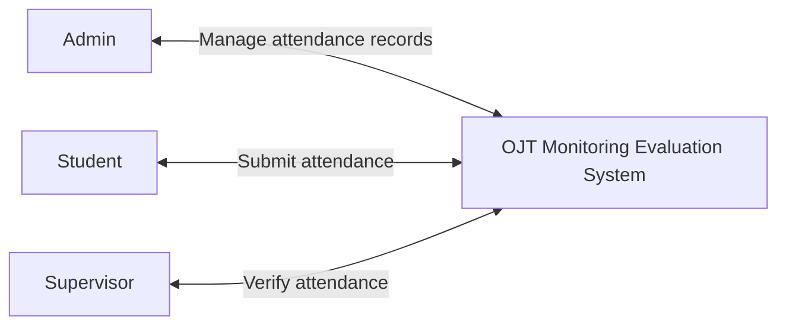

# OJT Monitoring Evaluation System - Simple ERD Style Diagram

This is a simple context-style ERD showing only the main users and their direct connection to the system.

## Simple Connections

- `Admin` -> manages attendance records in the system
- `Student` -> submits attendance to the system
- `Supervisor` -> verifies attendance in the system
